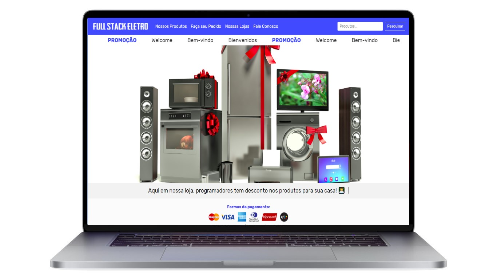

# Projeto Loja Virtual React + Node 

Esse projeto também utilizou BootStrap.

  

 

## Como Rodar o Projeto:

Depois de clonar esse diretório, instalar dependências:

### `yarn install`

No diretório do projeto, rodar o comando:

### `yarn start`

No diretório da Api ./src/backend/server.js, rodar o comando:

### `nodemon ./src/backend/server.js`

Crie Bancos de dados "fseletro" no Mysql 

Iniciar servidor Mysql localhost, root, senha vazia. 

(Esse projeto é para estudo, logo NUNCA deixe senha vazia em produção)

Abra [http://localhost:3000] para ver projeto React.

(http://localhost:3001) para ver dados Api.

Recode Pro 2021 by dgsdev
